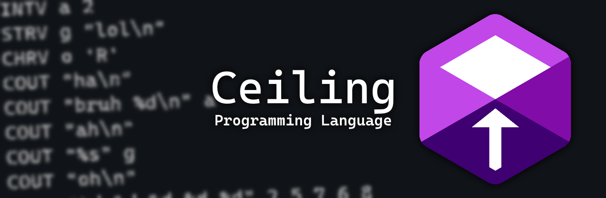

<h1 align=center></h1>
<p align=center><strong>Ceiling is a simple and easy to use compiled programming language.<br> It's currently being developed by a high school IT student for no actual reason.</strong></p>
<p align=center><sub><sub>(I am seriously considering changing the logo...)</sub></sub></p>

<h2>How the language looks like</h2>
<p>Ceiling wants to be friends with everyone.<br>It doesn't matter whether you're coming from Javascript, Lua, or even Assembly code. The way you're used to coding will not have to change drastically.</p>
<details>
  <summary>Assembly-like syntax "style":</summary>
  
  ```
  example_function:
    COUT "This is a function. Defaults to a void function if type is not specified.\n"

  another_example_function <int> int number:
    COUT "This is also a function. The type of this function is specified within the arrow brackets.\n"
    RETURN number

  start:
    COUT "This is the main function. All of your own functions go above it.\n"
    INT exampleInteger = 0
    FLOAT exampleFloat = 0.0
    BOOL exampleBoolean = false
    CHAR exampleCharacter = 'a'
    STRING exampleString = "This is an array of characters!"

    //Code is read line by line, therefore comments should only be on their own lines
    //This is how you can store user input within a variable
    CCIN "%s" exampleString

    //This way you can check for when the user presses [ENTER] (also good for flushing stdin after CCIN)
    CGIN 
    COUT "You said: %s\n" exampleString

    //This is how you call a function
    CALLIN example_function
    //This way you can store a returned value
    CALLTO another_example_function 10 TO exampleInteger

    //This is an if statement
    IF exampleCharacter == 'a' && exampleInteger == 0 THEN
      COUT "Yay!\n"
    ELIF exampleCharacter == 'b' THEN
      COUT "Yeah!\n"
    ELSE
      COUT "Oof\n"
    END

    //This is a for loop
    FOR i = 0 IN 10 THEN
      COUT "%d\n" i
    END

    //This is a while loop
    WHILE exampleBoolean THEN
      exampleBoolean = false
    END

    //This is a do-while loop
    DO
      exampleBoolean = true
    WHEN !exampleBoolean

  update:
    COUT "This is an update function! It goes at the very end of your program.\nIt repeats itself until the program is terminated.\n"
    //This is how you terminate your program
    CTER
  ```
  
</details>
<details>
  <summary>Javascript/Lue-like syntax "style":</summary>
   
  ```
  example_function:
    cout("This is a function. Defaults to a void function if type is not specified.\n");

  another_example_function <int> int number:
    cout("This is also a function. The type of this function is specified within the arrow brackets.\n");
    return number;

  start:
    cout("This is the main function. All of your own functions go above it.\n");
    int exampleInteger = 0;
    float exampleFloat = 0.0;
    bool exampleBoolean = false;
    char exampleCharacter = 'a';
    string exampleString = "This is an array of characters!";

    //Code is read line by line, therefore comments should only be on their own lines
    //This is how you can store user input within a variable
    ccin("%s", exampleString);

    //This way you can check for when the user presses [ENTER] (also good for flushing stdin after CCIN)
    cgin();
    cout("You said: %s\n", exampleString);

    //This is how you call a function
    callin(example_function);
    //This way you can store a returned value
    callto(another_example_function, 10) to exampleInteger;

    //This is an if statement
    if exampleCharacter == 'a' && exampleInteger == 0 then
      cout("Yay!\n");
    elif exampleCharacter == 'b' then
      cout("Yeah!\n");
    else
      cout("Oof\n");
    end

    //This is a for loop
    for i = 0 in 10 then
      cout("%d\n", i);
    end

    //This is a while loop
    while exampleBoolean then
      exampleBoolean = false;
    end

    //This is a do-while loop
    do
      exampleBoolean = true;
    when !exampleBoolean

  update:
    cout("This is an update function! It goes at the very end of your program.\nIt repeats itself until the program is terminated.\n");
    //This is how you terminate your program
    cter();
  ```
 
</details>
<details>
  <summary>This is also legal:</summary>

  ```
  start:
    cOuT;"This is fine",(
  ```

</details>

<h2>How it works</h2>
<p>The Ceiling Compiler is written in C++ and compiles your project into C code, which is then compiled using gcc. <br><sub><sub>(Basically, make sure you have gcc working)</sub></sub></p>
<h3>How to compile your project</h3>
<p>Works similarly to how you would compile your project using gcc/g++. (Depending on the operating system, you would want to include a file extension like ".exe")</p>
<pre><code>ceilbuild -o [path to your .ceil file] [path to your final executable file]</code></pre>
<p>You can also check your compiler's version by doing this.</p>
<pre><code>ceilbuild -v</code></pre>
<h3>The documentation:</h3>
<p>To check all the "opcodes" and the syntax, do this.</p>
<pre><code>ceilbuild -h [page number]</code></pre>
<p>I am currently not working on a proper documentation yet, so this is all you get at the moment.</p>
<h3>How to quit Vim:</h3>
<p>Just in case...</p>
<pre><code>:q!</code></pre>
<p>It's not related to Ceiling, just wanted to let you know. :3</p>

<h2>Future plans so far</h2>
<h3>Some of the things I have in mind include:</h3>
<ul>
  <li>Adding SDL support, because GUI slaps hard</li>
  <li>Making web scraping easier, because the reddit api pricing is a joke</li>
  <li>Libraries, because... libraries are pog</li>
  <li>Math functions, so you don't have to make them by yourself</li>
</ul>
<p><sub>(None of the above is guaranteed to happen tho...)</sub></p>

<h2>Links related to the github repo</h2>
<h3><a href="LICENSE">License</a></h3>
<h3><a href="CONTRIBUTING.md">Contributing</a></h3>
<h3><a href="CODE_OF_CONDUCT.md">Code of conduct</a></h3>
<h3><a href=".github/ISSUE_TEMPLATE/bug_report.md">Bug reports</a></h3>
<h3><a href=".github/ISSUE_TEMPLATE/feature_request.md">Feature requests</a></h3>
