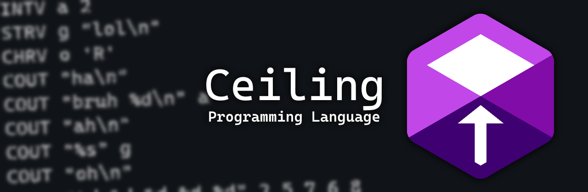

<h1 align=center></h1>

<strong>Ceiling is a simple compiled programming language.  It's currently being developed by a high school IT student for no actual reason.</strong>

(I am seriously looking forward to changing the logo...)

<h2>How it works</h2>

The compiler goes through these steps:

<ol>
  <li>Check line</li>
  <li>Convert line to C code (hence why the logo is a reskin of the C logo)</li>
  <li>Repeat until there are no lines left</li>
  <li>Finally, use gcc to compile our C code</li>
</ol>

(gcc is required for it to work)

I first had planned to use x86 assembly language instead of C... but I actually don't know assembly language yet... so C it is!

<h2>Future plans so far</h2>

Some of the things I have in mind include:

<ul>
  <li>Adding SDL support, because GUI slaps hard</li>
  <li>Making web scraping easier, because the reddit api pricing is a joke</li>
  <li>Winning the Nobel Peace Prize</li>
  <li>Becoming a corporate entity</li>
  <li>Getting drowned in money and fame</li>
  <li>Enslaving entire nations</li>
  <li>Becoming the leader of the whole universe</li>
  <li>Adding Functions</li>
</ul>

(None of the above is guaranteed to happen tho...)

